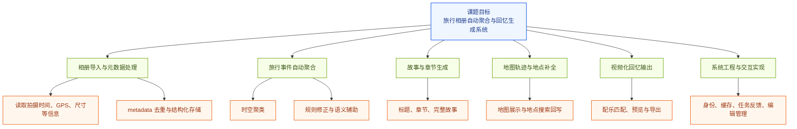
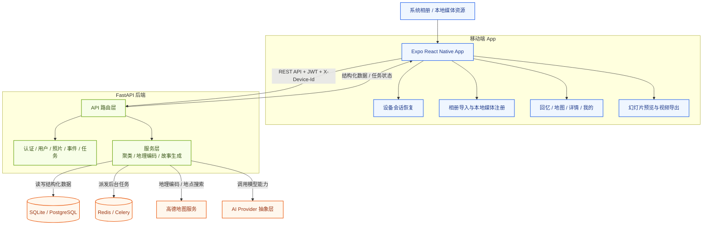

# 旅行相册自动聚合与回忆生成系统的设计与实现

## 一、项目概述

本课题聚焦于旅行相册自动整理与回忆生成场景，目标是构建一套从相册导入、事件聚合、故事生成到视频导出的完整系统。针对用户在旅行结束后面临的“照片多、整理难、难以形成完整回忆”的普遍问题，系统尝试利用照片的拍摄时间、地理位置、视觉内容和情绪线索，对零散照片进行结构化处理和叙事化重构，最终生成可浏览、可编辑、可导出的旅行回忆内容。

从系统形态上看，本课题并非只实现单一算法模块，而是完成了一套移动端与后端协同工作的综合性软件系统。移动端负责相册读取、用户交互、本地缓存、视觉分析结果展示和视频导出；后端负责结构化数据管理、聚类处理、故事生成、异步任务调度和接口服务。整体上，本课题兼具工程实现价值和一定的智能化处理探索意义，属于多模态分析、移动应用开发和智能内容生成相结合的综合实践型毕业设计。

| 项目 | 内容 |
| --- | --- |
| 课题名称 | 旅行相册自动聚合与回忆生成系统的设计与实现 |
| 项目形态 | 移动端 App + 后端服务 + 异步任务系统 + AI 内容生成 |
| 当前阶段 | 主体功能基本完成，正在继续优化聚合算法、身份管理与缓存机制 |
| 当前成果形式 | 可运行系统、源代码、阶段性测试结果、中期答辩材料 |

**图1 项目整体概念图**

---

## 二、课题背景、研究目标与主要任务

### 1. 课题背景

随着手机拍摄能力和存储容量的提升，用户在旅行过程中往往会产生大量照片和视频素材。这些素材虽然记录了真实的旅行经历，但通常长期停留在系统相册中，缺少系统化整理、故事化组织和情绪化回顾的能力。现有相册产品更多强调图片存储、时间轴浏览或云同步，而较少针对一次完整旅行自动生成具有结构、叙事和展示效果的回忆内容。

在这样的背景下，本课题希望围绕旅行回忆这一具体场景，探索如何将多模态信息和工程系统结合起来，让用户尽量少做手动操作，就能获得较完整的旅行事件划分、地图轨迹、故事文本和视频化回顾结果。

### 2. 研究目标

本课题的总体目标，是设计并实现一套面向旅行场景的自动回忆生成系统，使系统能够在尽量减少用户手动整理成本的前提下，对旅行照片进行聚合、分析和重构，并输出结构化、叙事化和可展示的结果。具体目标包括：

1. 支持从手机相册读取旅行照片的基础元数据，包括拍摄时间、地理坐标、图像尺寸等信息。
2. 基于时空特征和视觉线索，将零散照片自动聚合为具有连续性的旅行事件片段。
3. 在事件结果基础上生成标题、章节、故事文案和整体回忆内容。
4. 提供地图展示、地点补全、照片管理、事件编辑和回忆浏览能力。
5. 支持基于事件内容生成可预览、可导出的旅行幻灯片视频。
6. 形成可运行的软件系统、关键技术实现说明以及后续论文可使用的实验和截图材料。

### 3. 课题主要任务

围绕上述目标，本课题主要完成以下几类任务：

#### （1）相册导入与元数据处理

系统需要支持从用户手机相册中读取旅行照片，并提取拍摄时间、GPS 位置、宽高、文件大小等元数据。为了避免重复导入，还需要建立基于 metadata 的去重机制，并对导入结果进行结构化存储。

#### （2）旅行事件自动聚合

系统需要根据照片之间的时间关系、空间关系以及视觉语义相似性，将零散的照片聚合为更符合用户真实记忆方式的事件片段。这一部分是本课题的关键技术任务之一。

#### （3）故事与章节生成

在完成事件聚合后，系统需要根据事件结构和照片分析结果生成事件标题、章节内容、完整故事和摘要信息，从而将静态照片组织成更具叙事性的旅行回忆。

#### （4）地图轨迹与地点补全

系统需要基于照片中的 GPS 信息展示旅行事件在地图上的分布情况，并支持地点搜索、地点补全和位置信息修正，使回忆结果不仅有时间线，也有空间线索。

#### （5）视频化回忆输出

系统需要在事件和故事基础上构建幻灯片播放与导出能力，并结合事件情绪和场景信息进行配乐匹配，使用户能够获得更完整的旅行视频化结果。

#### （6）系统工程与交互实现

除了算法和内容生成外，系统还需实现用户身份识别、任务进度反馈、本地缓存、事件编辑、照片管理、错误恢复等工程环节，保证整个系统可运行、可演示、可持续完善。

**图2 课题目标与主要任务分解图**

---

## 三、技术架构路线与总体设计

### 1. 总体技术路线

本系统采用“移动端主入口 + 后端结构化处理 + 异步任务调度 + 外部服务辅助”的总体技术路线。移动端负责读取系统相册、触发导入、维护本地媒体映射、展示回忆内容并执行视频导出；后端负责管理照片 metadata、事件结构、故事生成、地理编码和任务调度；异步任务系统负责处理耗时的聚类、地理编码和 AI 生成流程；地图与 AI provider 则作为外部能力支持系统完成位置分析和文本内容生成。

这一架构的核心思想是：在保证系统可运行和交互完整的前提下，尽量减少原始图片上传压力，强调“本地优先、结构化上传、后台异步生成”的工程路线，以兼顾用户体验、隐私策略和系统复杂度控制。

### 2. 系统总体架构

**图3 系统总体架构图**

### 3. 移动端架构设计

移动端使用 Expo 54、React Native 0.81 和 Expo Router 构建，当前已形成较稳定的页面与服务分层结构。

#### （1）页面层

页面层主要由回忆页、地图页、事件详情页、幻灯片页和个人中心组成，承担用户浏览、编辑、导入和播放等交互任务。

#### （2）状态与本地服务层

系统使用 Zustand 管理设备会话等全局状态，使用 AsyncStorage 和 FileSystem 维护 token、本地媒体注册表、导入任务记录和导出缓存，从而保证在默认不上图的前提下，仍然能够利用本地 URI 展示相册内容。

#### （3）端侧分析与导出层

移动端还承担了端侧视觉队列回写和视频导出逻辑。前者用于补充照片的视觉描述和情绪线索，后者用于完成旅行幻灯片的预览和导出。

### 4. 后端架构设计

后端基于 FastAPI 构建，采用 API 路由、服务层、数据模型和异步任务编排相结合的结构。

#### （1）接口层

当前主要包括认证接口、用户接口、照片接口、事件接口、任务接口和管理接口，负责接收移动端请求并返回结构化结果。

#### （2）服务层

服务层承担事件聚合、状态刷新、地理编码、故事生成、增强故事等核心逻辑，是后端真正的业务中心。

#### （3）异步任务层

系统使用 Celery 和 Redis 执行聚类、地理编码和故事生成任务，并通过任务状态接口向前端反馈进度，避免用户在导入阶段长时间阻塞等待。

### 5. 关键技术路线拆解

| 技术方向 | 采用方案 | 当前说明 |
| --- | --- | --- |
| 移动端框架 | Expo 54 + React Native + Expo Router | 已支撑完整页面和导航流程 |
| 本地状态管理 | Zustand | 已用于设备会话恢复与状态维护 |
| 本地缓存 | AsyncStorage + FileSystem | 已用于媒体映射、导入记录、导出缓存 |
| 后端框架 | FastAPI + SQLAlchemy + Alembic | 已完成主要数据模型和接口实现 |
| 异步任务 | Celery + Redis | 已用于聚类、地理编码、故事生成等任务 |
| 地图能力 | 高德地图原生模块 + 地理编码服务 | 已实现地图展示与地点补全 |
| 内容生成 | AI Provider 抽象层 | 已支持多种模型服务接入 |
| 隐私策略 | 默认不上图，只上传 metadata | 已成为当前主链路的核心约束 |

### 6. 核心业务流程

系统当前已经打通了从相册导入到回忆生成的完整主流程，核心链路如下：

1. App 启动后自动恢复本机设备身份，如本地无有效身份则自动调用设备注册接口。
2. 用户从系统相册选择照片，或主动触发最近 200 张照片导入。
3. 移动端读取照片元数据，并通过 metadata 去重接口排除重复数据。
4. 新照片 metadata 被上传到后端，同时本地注册 `assetId -> localUri` 映射。
5. 端侧视觉分析队列异步补充照片视觉结果，并回写到后端。
6. 后端触发聚类任务，对照片进行事件划分、地理编码和故事生成。
7. 前端通过回忆页、地图页和事件详情页展示结构化结果。
8. 用户可手动编辑事件标题、地点和照片归属，后端会自动刷新摘要并重生成故事版本。
9. 用户进入幻灯片页面后，可基于当前事件生成预览视频并导出成片。

**图4 端到端业务流程图**

### 7. 聚合算法设计路线

本课题中的照片聚合不是简单按固定时间切分，而是采用“时空密度聚类 + 时间规则后处理 + 语义辅助合并”的混合路线。

#### （1）基础时空聚类

系统根据照片拍摄时间和 GPS 信息构建时空距离矩阵，优先使用 DBSCAN，在可用环境下结合 HDBSCAN 执行密度聚类，以适应不同规模和分布特征的数据集。

#### （2）时间规则修正

在基础聚类结果上，系统还会执行短间隔合并、大间隔切分、超长跨度事件切分、跨城市跳跃拆分、小事件合并和夜间单张噪声过滤等规则修正，以提高聚合结果的可解释性和稳定性。

#### （3）语义辅助合并

系统会抽取事件中的代表照片，结合时间、位置和照片描述信息构造语义向量，对相邻且语义接近的事件做辅助合并，从而提升同一连续旅行片段的聚合效果。

这一设计兼顾了旅行场景的复杂性与当前工程可实现性，也是下一阶段继续优化的重点方向。

**图5 聚合算法路线图**

---

## 四、开题以来所做的具体工作和取得的进展

### 1. 前期需求梳理与系统方案确定

开题后，首先结合课题要求对系统目标进行了拆解，将整体问题划分为导入、去重、聚类、地图、故事、视频、用户信息和任务反馈等若干模块，并逐步明确了当前系统的设计口径，即“单设备优先、隐私优先、默认不上图、以旅行回忆整理为主目标”。这一方案使系统避免陷入通用云相册或多设备同步系统的复杂度中，而更加聚焦于本课题最核心的自动整理与回忆生成目标。

### 2. 移动端部分的主要完成工作

目前移动端主流程已经基本打通，主要完成内容如下。

#### （1）设备会话与身份恢复

系统已实现 App 启动自动恢复本机身份，若本地 token 失效或缺失，则自动重新完成设备注册，从而避免传统登录页打断用户首次使用流程。这一链路已经能够稳定支撑当前单设备使用模式。

#### （2）回忆主页与导入入口

系统已完成回忆主页设计，实现了最近回忆 Hero 卡片、按月份分组浏览、回忆状态提示、最近照片导入和手动补导入等核心入口，使用户可以从导入到浏览形成连续操作。

#### （3）相册导入与本地媒体注册

系统已实现最近 200 张照片自动导入、手动从相册补导入以及导入到当前事件等能力。为了避免默认上传原图，系统建立了本地媒体注册表，能够维持 `assetId / photoId / metadata` 与本地 `localUri` 的映射，使页面在不上图的情况下依然能够展示本机图片。

#### （4）地图与地点补全

系统已完成地图页实现，支持高德地图展示、事件聚类、待补地点提示、地点搜索和地点回写，从而让旅行回忆不仅有时间顺序，也具备空间轨迹表达。

#### （5）事件详情、照片管理与编辑

系统已实现事件详情页，支持展示故事引子、章节内容、照片网格、完整故事和状态信息；同时支持编辑标题、地点、封面和照片归属，并在结构变化后触发后端摘要刷新和故事更新。

#### （6）幻灯片播放与视频导出

系统已实现幻灯片场景构建、配乐匹配、预览播放和视频导出能力，使回忆结果从列表和文字进一步扩展到视频表达层。

#### （7）个人中心与任务中心

系统已完成个人中心页面，支持昵称编辑、头像上传、导入记录查看和导入任务入口，并通过任务中心向用户反馈导入、分析、同步和故事生成四阶段进度。

| 移动端模块 | 当前状态 | 说明 |
| --- | --- | --- |
| 设备会话恢复 | 已完成 | 支撑自动设备身份初始化 |
| 回忆主页 | 已完成 | 支撑回忆浏览和导入入口 |
| 相册导入 | 已完成 | 支撑最近导入与手动补导入 |
| 本地媒体注册 | 已完成 | 支撑不上图场景下的本地展示 |
| 地图页 | 已完成 | 支撑空间维度浏览与地点补全 |
| 事件详情与编辑 | 已完成 | 支撑故事、章节、照片和编辑交互 |
| 幻灯片与导出 | 已完成 | 支撑视频预览与导出 |
| 个人中心与任务反馈 | 已完成 | 支撑用户信息与进度反馈 |

`[图片占位：图6 回忆主页截图，建议放首页 Hero 卡片和回忆列表]`

`[图片占位：图7 地图页截图，建议放地图聚类与地点补全提示]`

`[图片占位：图8 事件详情页截图，建议放章节、照片网格和故事内容]`

### 3. 后端部分的主要完成工作

后端部分围绕“结构化数据管理 + 异步任务处理 + 内容生成”完成了较为完整的实现。

#### （1）认证与用户模块

后端已实现基于 `device_id` 的自动注册与 JWT 鉴权逻辑，能够为当前单设备模式提供稳定的身份基础。同时，已实现用户资料查询、更新和头像上传等基本能力。

#### （2）照片模块

后端已实现 metadata 去重、批量写入、照片单张更新、批量移动、批量删除和事件联动刷新等能力，是当前数据导入主链路的核心组成部分。

#### （3）事件模块

后端已实现事件列表、事件详情、事件创建、编辑、删除、地点搜索、手动重生成故事等能力。同时，事件模块还维护事件版本、故事版本、新鲜度和结构变化状态，是保证回忆内容一致性的关键部分。

#### （4）任务模块

后端已实现聚类、地理编码、故事生成和增强故事等异步任务编排，并通过任务状态接口向前端返回任务阶段和结果，保证耗时操作能够后台执行。

#### （5）AI 接入与地图服务

后端已完成 AI provider 抽象，当前支持多种模型服务接入；同时整合了地图服务用于地点搜索、位置反查和事件位置信息补全。

| 后端模块 | 当前状态 | 说明 |
| --- | --- | --- |
| 认证模块 | 基本完成 | 已完成设备自动注册与基础鉴权 |
| 用户模块 | 已完成 | 已支持资料和头像相关能力 |
| 照片模块 | 已完成 | 已支持 metadata 上传与事件联动 |
| 事件模块 | 已完成 | 已支持列表、详情、编辑、故事刷新 |
| 地图与地理编码 | 已完成 | 已支持搜索与位置补全 |
| 任务模块 | 已完成 | 已支持后台异步任务执行 |
| AI 接入层 | 已完成 | 已支持多 provider 接入 |

### 4. 聚合、叙事与多媒体生成方面的进展

围绕毕设要求中的核心研究内容，当前系统已经形成以下阶段性成果：

1. 已建立基于拍摄时间与地理位置的照片聚合基础能力。
2. 已引入时空密度聚类、时间规则修正和语义辅助的混合聚合方案。
3. 已实现照片视觉结果回写，用于后续故事和情绪标签生成。
4. 已实现事件标题、章节内容、完整故事和摘要展示。
5. 已实现基于情绪与场景标签的配乐匹配逻辑。
6. 已实现回忆视频预览与导出能力。

需要说明的是，当前音乐部分更准确的表述应为“配乐匹配与视频导出链路已打通”，而不是完整意义上的原创音乐模型训练与生成。后续论文撰写时会按真实实现口径进行说明。

### 5. 测试与验证进展

为了验证聚合算法和系统主流程的可用性，当前项目已经编写和整理了一批测试代码与测试用例，特别是在聚类场景方面覆盖了以下典型情况：

- 单一景点短时间连续拍摄
- 一天内多个景点切换
- 多城市连续旅行
- 海外长途旅行
- 无 GPS 场景
- 跨天活动场景
- 超大规模照片集
- 夜间单张噪声过滤

这些测试说明，当前系统已经从“功能是否能跑起来”进入到“场景是否稳定、结果是否合理”的验证阶段，为后续论文实验与算法优化打下了基础。

`[图片占位：图9 聚类效果对比图，建议放“原始照片分布与聚合后事件结果”的对比示意]`

### 6. 当前阶段性成果总结

截至目前，本课题已经取得以下较为明确的阶段成果：

1. 已形成可运行的移动端与后端一体化系统。
2. 已完成从相册导入到回忆生成的主流程闭环。
3. 已实现回忆浏览、地图展示、事件编辑、故事展示和视频导出等关键功能。
4. 已初步建立适用于旅行照片场景的事件聚合路线。
5. 已积累一定量的测试样例、界面截图和结构化文档，可为论文撰写和中期答辩提供支撑材料。

---

## 五、当前存在的主要问题

虽然系统主体工作已经基本完成，但从中期阶段的要求来看，仍有一些问题需要继续完善。

### 1. 聚合算法在复杂场景下仍需继续优化

当前混合聚类方案能够处理大部分常见旅行场景，但在以下情形中仍可能出现聚合过粗或拆分过细的问题：

- 跨城市连续旅行中的切分点不够稳定；
- 同城市但不同主题活动之间容易被误合并；
- 照片分布稀疏时容易出现小事件或噪声事件；
- 长跨度旅行中的超长事件切分仍有进一步细化空间。

因此，聚合算法的稳定性和泛化能力仍是下一阶段最重要的优化方向。

### 2. 用户身份体系仍不够完整

当前系统主链路采用的是设备自动注册与基础鉴权方式，已经能够满足当前单设备使用模式，但更完整的账号登录、身份绑定和统一用户管理能力尚未完全补齐。如果后续需要扩展到更完整的账号体系，还需要进一步梳理设备与用户之间的关系设计。

### 3. 缓存机制与异常恢复能力仍需打磨

系统目前已经具备本地媒体注册、导入缓存、导出缓存等机制，但在以下方面仍有完善空间：

- 缓存命中和失效策略；
- 异常退出后的恢复能力；
- 本地数据与后端结构化数据的一致性维护；
- 大规模相册场景下的性能和稳定性。

### 4. AI 生成质量仍存在波动

当前故事文本和配乐匹配已经具备可用性，但其质量仍然受到模型能力、提示词设计和实际数据质量的影响。在不同数据规模和不同旅行场景下，故事细节、章节连贯性和配乐匹配度仍有一定波动，需要进一步通过真实案例优化。

---

## 六、下一步的主要研究任务、具体设想与安排

下一阶段将继续围绕“算法优化、工程补齐、论文材料整理”三条主线推进。

### 1. 聚合算法优化与场景验证

在 2026 年 4 月上旬至 4 月中下旬，重点继续优化聚合算法，结合已有测试样例和真实旅行数据，对时间阈值、空间阈值、语义相似度利用方式和跨城市切分规则进行进一步调优，提升算法在复杂场景下的稳定性和解释性。

### 2. 用户身份管理与缓存机制完善

在 2026 年 4 月中下旬，将在不破坏现有主流程的前提下继续梳理身份管理口径，完善本地缓存结构、异常恢复机制和一致性处理逻辑，使系统工程质量更接近最终交付状态。

### 3. 系统细节完善与测试补充

在 2026 年 4 月下旬至 2026 年 5 月上旬，继续完善故事生成、配乐规划、视频导出和页面交互细节，并补充更多端到端测试、性能测试和案例验证结果，形成更充分的实验与展示材料。

### 4. 论文与答辩材料整理

在 2026 年 5 月中旬以后，将集中整理系统架构设计、关键算法思路、阶段性测试结果和实现细节，逐步形成毕业论文正文内容，并同步准备答辩 PPT、系统演示视频和必要截图材料。

### 5. 预期产出

下一阶段计划形成以下成果：

1. 更稳定的旅行事件聚合算法版本；
2. 更清晰的身份管理与缓存策略说明；
3. 更完整的系统测试结果与案例图；
4. 可直接用于论文正文的架构图、流程图和功能截图；
5. 与系统实现保持一致的毕业论文和答辩材料。

| 时间安排 | 主要任务 | 目标 |
| --- | --- | --- |
| 2026-04-06 至 2026-04-20 | 聚合算法优化与案例验证 | 提升复杂旅行场景下的聚合准确率 |
| 2026-04-10 至 2026-04-25 | 身份管理与缓存完善 | 提升系统工程稳定性与一致性 |
| 2026-04-20 至 2026-05-10 | 系统细节打磨与测试补充 | 补齐实验结果与展示材料 |
| 2026-05-10 之后 | 论文与答辩材料整理 | 完成论文、PPT 与演示准备 |

---

## 七、建议补充的图片位置

为了增强中期材料和后续答辩材料的表达效果，建议后续优先补充以下图片：

1. 项目整体概念图  
2. 课题目标与任务分解图  
3. 系统总体架构图  
4. 端到端业务流程图  
5. 聚合算法路线图  
6. 回忆主页截图  
7. 地图页截图  
8. 事件详情页截图  
9. 聚类前后效果对比图  
10. 幻灯片预览或导出结果截图

如果时间有限，优先补这 5 张即可：

1. 系统总体架构图  
2. 导入到回忆生成的业务流程图  
3. 回忆主页截图  
4. 事件详情页截图  
5. 视频预览或导出结果截图
